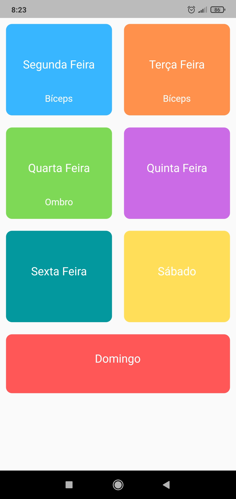
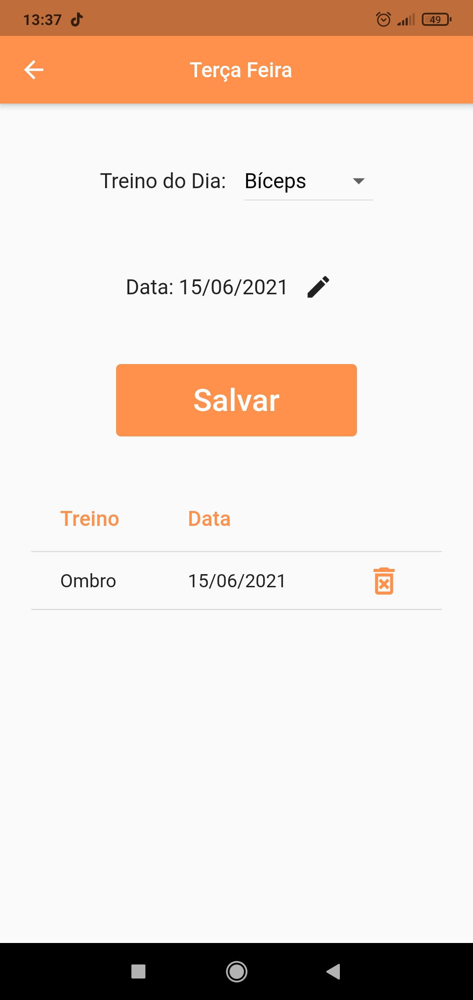

# Academia
 
## Sobre o Aplicativo
 #### O Academia é um aplicativo criando para anotar quais atividades foram feitos em quais dias, ele armazena a data e o tipo de treino que foi realizado, para que estas informações possam ser consultadas posteriormente ajudando o usuário a manter o controle de seus treinos.

 
 

## Releases

| Nome | Status APK |
|---|---|
| app-release.apk | [V1.2.0](https://github.com/TheuFerreira/Flutter-Academia/releases/tag/V1.2.0) | 
| app-release.apk | [V1.1.0](https://github.com/TheuFerreira/Flutter-Academia/releases/tag/1.1.0) | 

## Desenvolvimento
* Para o desenvolviemnto do aplicativo "Academia", foram utilizados os seguintes frameworks:
  - SQFLite: Para o armazenamento de Dados dentro da Aplicação.
  - Intl: Para a formatação das Datas.
  - Path Provider: Para o controle de caminhos do dispositivo mobile.
  - Provider: Para o gerenciamento do estado.
  - Flutter Launcher Icons: Para trocar o ícone da aplicação por um ícone customizado. 
#### Este Software, foi feito em conjunto com [Paulo Fernado](https://www.linkedin.com/in/paulo-fernando-071bb31a9/), que ficou responstável por toda a parte de Design da Aplicação.
