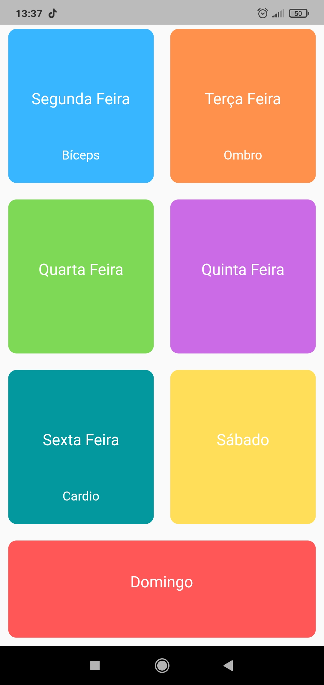

# Academia
 
### Sobre o Aplicativo
 - O Academia é um aplicativo criando para anotar quais atividades foram feitos em quais dias, ele armazena a data e o tipo de treino que foi realizado, para que estas informações possam ser consultadas posteriormente ajudando o usuário a manter o controle de seus treinos.

 
 

### Arquitetura
